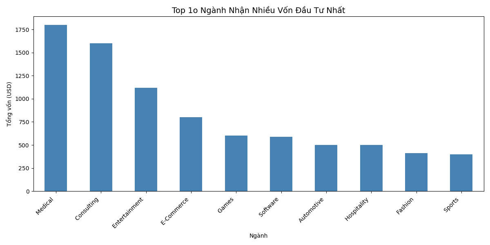
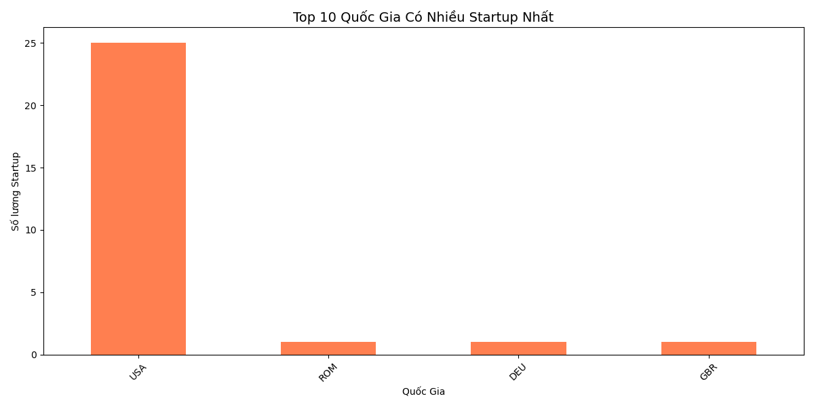
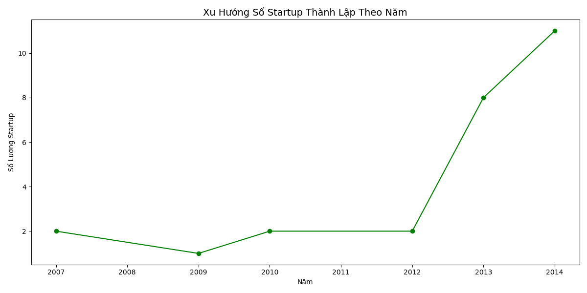
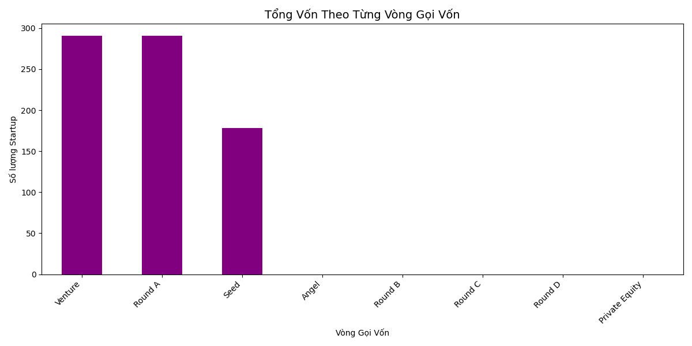

# Startup Funding Analysis

## Mục tiêu
Phân tích xu hướng đầu tư startup toàn cầu từ dữ liệu Crunchbase (`investments_VC.csv`) nhằm hiểu rõ ngành nào được ưa chuộng, quốc gia nào dẫn đầu và vòng gọi vốn nào phổ biến nhất trong hệ sinh thái startup thế giới

---

## Câu hỏi phân tích

1. Ngành nào nhận nhiều vốn đầu tư nhất? 
2. Quốc gia nào có nhiều startup nhất? 
3. Xu hướng startup theo năm như thế nào? 
4. Vòng gọi vốn nào phổ biến nhất? 

---

## Tools sử dụng

- **Python** — Pandas, Matplotlib, Seaborn
- **Jupyter Notebook**
- **Dữ liệu:** `investments_VC.csv` (Crunchbase)

---

## Tác giả: Lê Thành Trung
> Dự án phân tích dữ liệu cá nhân, sử dụng dữ liệu Crunchbase công khai
